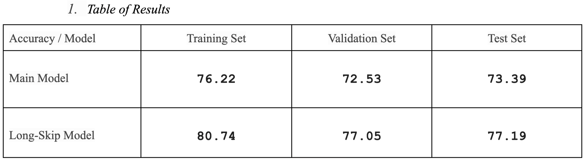
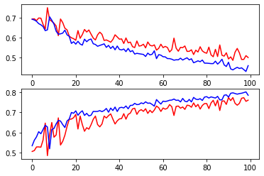
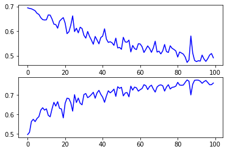
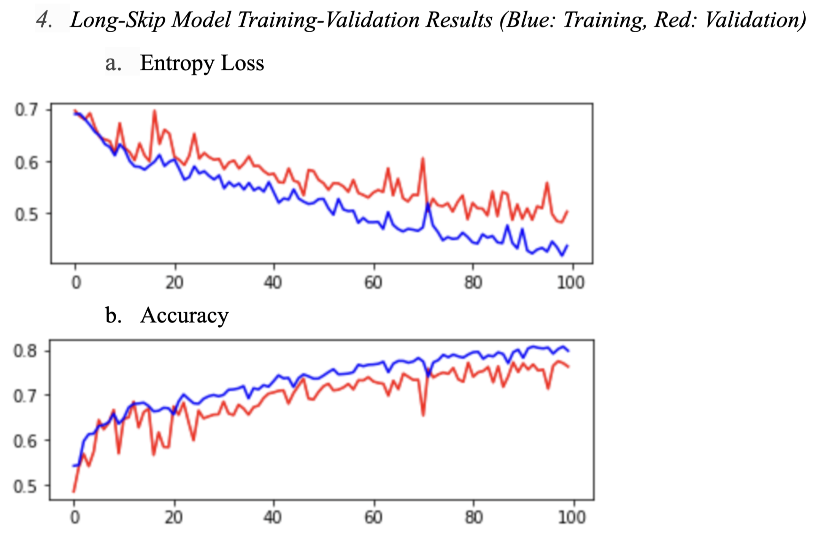
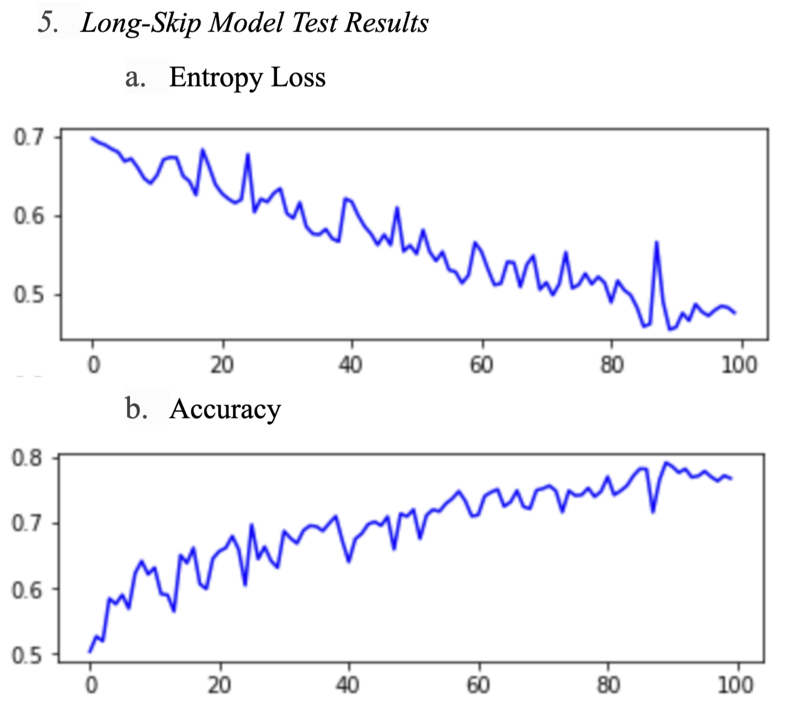
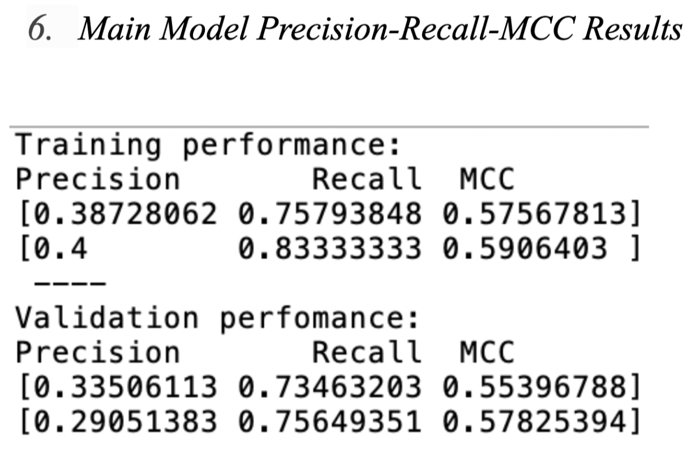
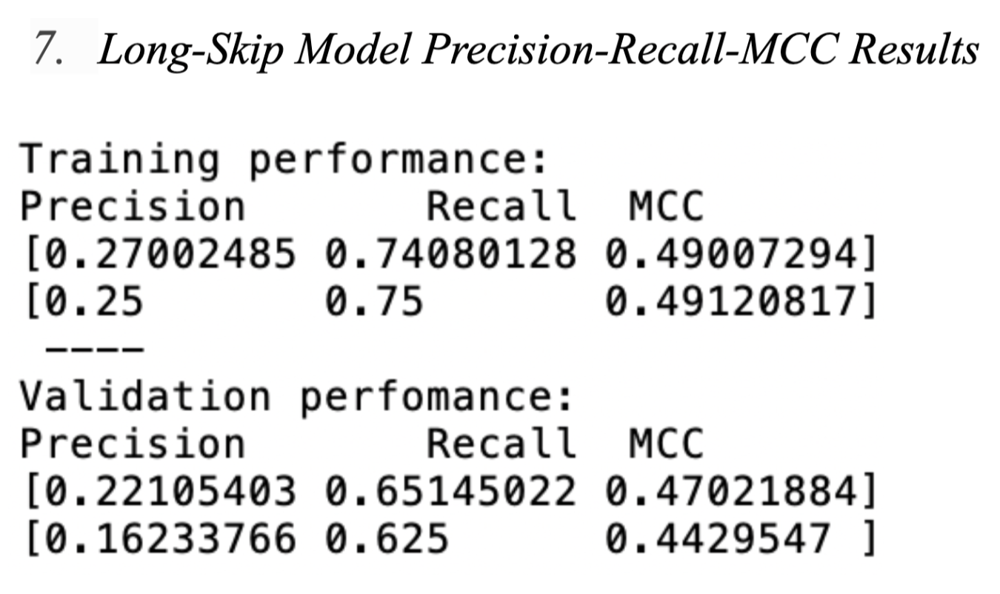

# Gland-Segmentation

The dataset can be accessed by this link: https://drive.google.com/drive/folders/1iCgoJ8A3kNdYVuuC1_0HZj1YFuUS4ExB?usp=share_link

## Problem Description

In this project, the main task is the accurate segmentation of glands in colon histology images of colorectal cancer (also known as gland segmentation task). 

The gland segmentation task is challenging because gland morphology is usually irregular and heterogeneous. Glands can have different shapes, sizes, and morphological features. Thus, accurate segmentation is critical to retrieve reliable morphological features afterward. Morphological features are then used by pathologists to measure to determine the malignancy level of glands.

For this purpose, I build two custom networks: a main network and a long-skip network. I preprocess images before the network and post-process them to obtain better results. I discuss the advantages and limitations of the used methods. I briefly compare and contrast the two methods. I also evaluate the results and suggest ways to improve.

## Data Description

The selected dataset was collected by pathologists at the University Hospitals Coventry and Warwickshire, UK in 2015. [1] The images are H&E stained slides, with varying histologic grades. The examined cancer type is colorectal cancer. The inputs are microscopy images and the desired outputs are masks that label each pixel if it is part of a gland or not. The dataset has ground truth annotations by pathologists. There are 165 images in the dataset. The training set size is 85, of which 37 are benign and 48 are malignant. The training set size is 80, of which 37 are benign and 43 are malignant. Each image has a size of 256x256x3. The image resolution is 0.62005𝝁/pixel. There is one ground truth object per label. The ground truth information for each image is stored in BMP format. The selected dataset is significant in the sense that prior to this challenge, gland segmentation had mostly been done in healthy or benign samples. The samples in this dataset include samples with high-grade cancer as well. However, there are two limitations of this dataset: First, there are only 165 images in the dataset. This number is very low, considering that datasets such as ImageNet have millions of images. Second, images are obtained from the same scanner, Zeiss MIRAX MIDI Slide Scanner. The fact that all images are obtained from the same scanner means that there is a high risk of overfitting.

## Methodology

I start by shuffling the entire image set at each epoch. I select N images for each batch. I resize
each image and recompile them into a batch. Here, I had to properly choose the size of batches, N. I then
use data augmentation to produce batches with minor modifications. In prediction, I resize an image. I
choose which kind of overlap I want. I get class probabilities for every pixel. As a result, I obtain a
prediction map for the whole image. Then, I compute evaluation metrics on the prediction maps.

I have three main parts to the project. First is the data generator. The data generator reads the images and preprocesses images with methods such as
scaling and resizing. It also applies data augmentation to manipulate images to increase the number. I then
generate batches of image-target pairs for training, validation, and testing. The second, is the deep
learning model. It has inputs of 256x256x3 and outputs of 256x256x2 masks. I train the network to
optimize the weights in the network. Third, I have the evaluation stage, where I have target-prediction
pairs as input and performance metrics as output. I use three evaluation metrics for this project. First, for
detecting individual glands, a metric allied F1-score is defined in the challenge website. [1] However, I
prefer to use precision and recall instead of the F1 score. The F1 score is not a good score for
segmentation because it is sensitive to imbalanced data and does not really tell us how the algorithm does.
Precision and recall in this application are more informative. Second, for segmentation, I use the
Matthews correlation coefficient (MCC) metric. MCC has two main advantages: First, it is symmetric, meaning that if I switch positives and negatives, I
still get the same value. Second, if MCC is close to 1, it means that both classes are predicted well. This makes MCC a very interpretable metric.

## Network Architecture

I compare two architectures: the main architecture and a long-skip architecture. For the main
model, I use a common architecture with an encoder and a decoder part. In the encoder part, I used
convolutional and pooling layers to extract feature maps. In the decoder part, I added convolution and
upscaling layers to increase the size to get a mask the same as the image. Here, one choice is how many
convolutional layers or how much pooling to make. The decoder part needed enough resolution coming
from the encoder part. I also had a tradeoff with the number of features and the number of convolutional
layers. The more convolutions, the more overfitting would be. Thus, I needed to balance that. For the
long-skip model, in addition to the above-mentioned features, shortcuts are made from the encoder part to
the decoder part. The main advantage of using long-skip connections is that it allows us to introduce
high-resolution image information into the later stages of the network. This, in turn, improves image
segmentation quality.

The constructed network has a simple structure: two max-pooling layers with two convolutions in
between and two upsampling layers in the decoder part. There are 128 features at the end of the encoder.
For the activation function, I chose ReLU, a common choice. I used the ‘same’ padding for the borders of
the image. For the optimization algorithm, I picked Adam optimizer. I included an early-stopping
condition with a certain number of patience. I use patience of 15-20 epochs in the model. If the model
does not learn for the time determined by the patience parameter, then I interrupted the model. I used
‘sparse categorical cross entropy’ as a loss function. With this network, I fit the parameters and get the
validation and training performances. I then get the prediction by using the trained network on the test set.

## Results

I obtain the following results:

- Overall, I obtained around 75% accuracy in predicting glands. 
- Test set performance is as good as the validation set for both models. 
- The long-skip model seems to perform better than the main model. 

- I obtained relatively low MCC results for both the main model and the long-skip model for training and validation. I obtained around 60-65% recall, which is fairly good. However, the precision was lower than expected. For this reason, I did not obtain the test results for
these metrics, but only interpreted what could be the reasons for such low values. One interpretation of
such low segmentation results is that the network architecture had difficulty separating adjacent glands.
These adjacent glands are usually much harder for algorithms to detect and learn. 

## Next Steps

As the next step, I could work more on the post-processing. Another solution could be to add a third class,
which would be the borders between the glands. This way, the algorithm could learn to learn borders
much better by penalizing the network during learning. In addition, low accuracy might be caused by
irregularly shaped glands. Another interpretation could be that the pre-processing methods were
inadequate and did not diversify images enough. As the next step, I could apply different pre-processing
techniques such as rotation or scaling.

## References:

[1] GlaS@MICCAI'2015: Gland Segmentation Challenge Contest, TIA Centre, Dept of Computer
Science, University of Warwick https://warwick.ac.uk/fac/cross_fac/tia/data/glascontest/
